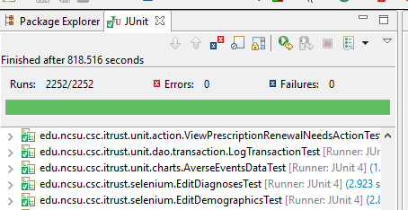

# HW1.P2 - Testing

In this homework assignment, you will be doing all things testing.
You learn and practice several skills for unit testing, mocking, and browser testing.

## Part 1 - Twitter (40 points)

Using [twitter4j](http://twitter4j.org/en/index.html), you will write a simple twitter analytics tool.

**BUT**, there is no api token configurd for the tool. You'll have to find out how to write code using this api without ever getting real tweets. **HOW**? By using [Mockito](http://site.mockito.org/)

The code repo has started with a basic stub and unit test.
`public Status mostRetweeted(List<Status> list)`

Complete the implementation and unit tests for the following functions. Use a TDD style approach to help you develop and test out your functions (10 points each -- including unit tests):

* `public Status leastRetweeted(List<Status> list)`
* `public String mostRetweetedPhoto(List<Status> list)` Return url of most retweeted photo in a single tweet. Use [MediaEntity.getMediaURL()](http://twitter4j.org/oldjavadocs/4.0.4/index.html). *That is, for all tweets that contain a photo, which one has the highest retweet count?*
* `public String mostTweetedPhoto(List<Status> list)` Return url of most tweeted photo across *all* tweets. *For example, 2 different pictures of octocat is shared by many people across many tweets. Which photo was most posted, including retweets counts?*
* `public int mostCommonWord(List<Status> list)` Return the most frequent occurrence of a word in a across *all* statuses.

##### Twitter


## Part 2 - Selenium (40 points)

You will help test out a survey hosting site, http://checkbox.io

Write unit tests that verify the following:
http://checkbox.io/studies.html

* The participant count of "Frustration of Software Developers" is 55
* The total number of studies closed is 5.
* If a status of a study is open, you can click on a "Participate" button.
* You can enter text into this study (don't have to submit): http://checkbox.io/studies/?id=569e667f12101f8a12000001

You'll have to adjust the driver used in order to properly render javascript:

```
	private static WebDriver driver;
	
	@BeforeClass
	public static void setUp() throws Exception 
	{
		//driver = new HtmlUnitDriver(true);
		//System.setProperty("webdriver.chrome.driver", "/Users/gameweld/classes/326/HW1.P2/hw1p2/chromedriver");
		ChromeDriverManager.getInstance().setup();
		driver = new ChromeDriver();
	}
	
	@AfterClass
	public static void  tearDown() throws Exception
	{
		driver.close();
	}
```

Add the following maven dependency:
```
	<dependency>
  		<groupId>io.github.bonigarcia</groupId>
  		<artifactId>webdrivermanager</artifactId>
  		<version>1.3.1</version>
	</dependency>    
```

## Part 3 - iTrust (20 points)

You simply must get all iTrust unit tests passing.



Use all available resources to make this happen. This is the last chance before we go full iTrust.

#### Errors

The output of the failing error cases are very helpful. If you can't get a connection to a db, you need to start your mysql service. If you can't find a web element, you don't have tomcat/iTrust running. If you see an invalid "0000-00" date, then you need to update mysql settings related to date:

* Check out https://github.com/CSC-326/AutoInstall/ you're having trouble getting your env setup.
* You might have to manually reset mysql and tomcat if you've had the service running long-term.
* If you are running mysql 5.7.10 (latest), make sure you set my.ini to avoid date errors:
```
[mysqld]
sql_mode = ""
```

## Submission

1. Add your TA to your repo. 
2. Use `git remote set-url origin` to update your new repo. See https://help.github.com/articles/changing-a-remote-s-url/
3. Commit your code for your twitter unit tests.
4. Include a HW1.P2.md, which includes 
	* a short description of your homework assignment
	* your code and unit tests!
	* a screen shot of your passing twitter tests
	* a screen shot of your passing web tests
	* a screen shot of your passing iTrust test cases.
5. On moodle, submit the link to this repo.

DUE: Wednesday, Feb 3rd, midnight
